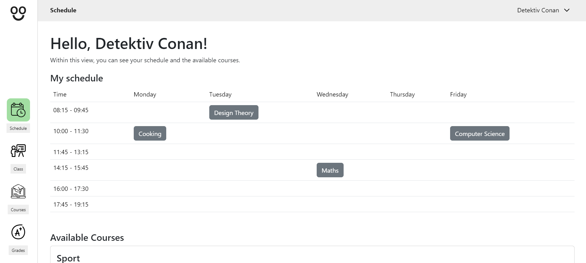

# Bloom

## Contents
- [Members](#members)
- [Technologies](#technologies)
- [Introduction](#introduction)
- [Purpose and goal](#purpose-and-goal)
- [Application architecture](#application-architecture)
  - [Components](#components)
  - [Available views](#available-views)
- [Future work](#future-work)

## Members
| Student          | Kürzel | Matrikel-Nr. |
| ---------------- | ------ | ------------ |
| Mariya Stoyanova | ms598  | 43383        |
| Florian Winkler  | fw061  | 40141        |

# Technical documentation

## Technologies
| Frontend            | Styling            |
| ------------------- | ------------------ |
| Vue.js 3, TypeScript| bootstrap-vue-next |

## Introduction
This is the frontend for BLOOM web software. BLOOM is a web application that allows students and teachers to manage their school year.

## Purpose and Goal
Initially we thought about three different user groups. `Admin`, `Teacher` and `Student`. As we are only a small team of two people and we only had one semester, we decided to focus on the admin view and the view for the students.

An `Admin` can configure basically everything.

## Application architecture

We decided to use Vue.js as a frontend framework.
The entry point of the code is the `src` folder. We have split the main responsibilities within the `components`, `router` and `views` folder.

### Components
We used `bootstrap-vue-next` to generally style our web application. Though we created some components, in order to disply our data in another more individual manner. These components are used mainly in the `Admin` panel, nevertheless they can be integrated in every view of the app.

### Available views

`/Login` This is a general login view. After a user has been logged it, a corresponding overview page is shown. Students, teachers and admins have different views and can do different things from then on.

`/admin`
This is a general view for a school admin. There all the different accessible views are displayed. Here is a lost of all available views:

- `/Student`
  This view is for the admin to configure everything related to the students. The admin can:
  - `create.vue`
  - `details.vue`
  - `index.vue`
- `/class`
  This View is for configuring all available classes. A class represents a school class. The school classes have a `rank` that represents the class level. We have decided to use class levels from class level `5`, `6`, `7`, `8`, `9`, `10`, `11`, `12` and `13`. A school class holds an array of students within its class. Every student has exactly one class whereas one class can have multiple students. The admin has the options to configure:
  - `create.vue`
  - `details.vue`
  - `index.vue`
- `/Course`
  This view is for configuring all available courses. A student can have multiple courses whereas a course also can hold multiple students.
  - `create.vue`
  - `details.vue`
  - `index.vue`
- `/Teacher`
  This view is for configuring all teachers. A teacher can be then further assigned to a class as a class teacher or to a course as a course teacher.
  - `create.vue`
  - `details.vue`
  - `index.vue`
- `/Examination`
  This view is for configuring all exams. In this view all created exams per rank and per course are being displayed.
  - `create.vue`
  - `details.vue`
  - `index.vue`
- `/Grading`

`/`
- `Schedule`
This is the first view shown to a student that has been logged in. Here a table with timeslots and weekdays is displayed. If a student has already registered for a course or an admin has added this particular student to a course, it will be show in the table. Otherwise a list with available courses for the student's rank/class are displayed and can be added to the schedule directly.

- `Class`
This is a class overview for a student. Here different infos about the student's class is displayed - the class name, class teacher and all the class students. Furthermore, if there are any announcements for this class, they are also going to be diplayed (see [future work](#future-work--improvements)).

- `Courses`
This view serves as a overview for all courses the student has registered for. For every course the upcoming and already passed exams are shown, the corresponding grades (see [future work](#future-work--improvements)) and other course contents, for example the course teacher, are also available.

- `Grades`
This section is a part of your [future work](#future-work--improvements). Here all the grades of the student for the corresponding courses are shown.

`/Settings`This view is for configuring a users account. Disregarding if the user is a studen, teacher or admin, they always have the option to change their password. Other account condfigurations can be found in [future work](#future-work--improvements)

## Future work
`Admin` - The future improvements in regards to the admin panel are:
  - jfdosf

`Students` - What we would like to add to this section of the software is:
  - Teachers should be able to make announcements and post them in the class. These announcements should be accessible for students within the `Class` view.
  - In the `Courses` section we would like to display the current grades of the students.
  - A `Grades` section with all the grades, so that students have a direct overview of the grades they have accomplished.

`Teacher` - The last general improvement is an accessible pages for teachers. There they can configure their class, as well post announcements and give grades to the students for their courses.

`Settings` - Here we want to enable users, apart from changing their passwords, to also change their personal data. Currently only the admin can change this information, but we consider it also the user's responsibility to keep their info up to date.

